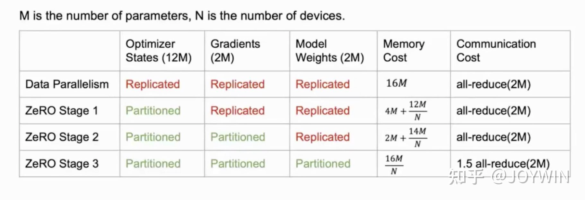

# LearnDeepSpeed 🚀
目的：基于DeepSpeed，突破硬件限制，实现大模型高效训练。

- 收录到[PytorchNetHub](https://github.com/bobo0810/PytorchNetHub)


# 最小示例

- [cifar示例](training/cifar/README.md)
  - 分布式数据并行DDP的训练pipeline
  - MoE用法
  - 学习率调度器的配置
  - ZeRO零冗余优化器的配置
- [pipeline_parallelism示例](training/pipeline_parallelism)
  - 流水并行的训练pipeline
  - 流水模型的保存、加载、指标评估
  - TensorBoard可视化


## 配置
- 等效batch计算
  
- TensorBoard可视化
  ```json
  "tensorboard": {
    "enabled": true,  //开启可视化
    "output_path": "log/", //可视化文件保存路径
    "job_name": "2023年08月15日16:28:06" //此次实验名称，作为子文件夹
  }
  ```
  参考 [Link](https://www.deepspeed.ai/docs/config-json/#monitoring-module-tensorboard-wandb-csv)
- ZeRO零冗余优化器
  ```txt
  stage0: 禁用ZeRO优化
  stage1: 划分优化器状态
  stage2: 划分优化器状态＋梯度
  stage3: 划分优化器状态＋梯度＋模型参数
  ```
  
- 指定GPU运行
  ```shell
  # 本机第0张卡
  deepspeed --include="localhost:0"  xxx.py --deepspeed --deepspeed_config xxx.json
  ```
- 模型加载&评估
  
  第一种：deepspeed推理引擎

  https://www.deepspeed.ai/tutorials/inference-tutorial/

  第二种：torch原生加载
  ```python
  state_dict = torch.load("xxx.pt",map_location=torch.device('cpu'))["module"]
  model = resnet50()
  model.load_state_dict(state_dict)

  # 评估
  model.eval()
  with torch.no_grad():
      outputs = model(inputs)
  ```

- 两种传参格式
  1. 配置文件
  ```shell
  deepspeed  train.py --deepspeed  --deepspeed_config ds_config.json
  ```

  2. 配置参数
  ```python
  # bash 
  ds_config = {"train_batch_size": 16}
  engine, _, _, _ = deepspeed.initialize(model=netconfig=ds_config)
  ```
  ```shell
  deepspeed  train.py --deepspeed 
  ```
- AMP自动混合精度
  > 注：与FP16、ZeRO不兼容
  ```json
  "amp": {
    "enabled": true, //是否开启混合精度训练
    "opt_level": "O1", //优化级别
  }
  ```
  - O0：纯FP32训练
  - O1：混合精度训练（推荐），根据黑白名单自动决定使用FP16（对 Tensor Core 友好的操作, 如GEMM, 卷积）还是FP32（Softmax）进行计算。
  - O2：“几乎FP16”混合精度训练，不存在黑白名单，除了BN，几乎都是用FP16计算。
  - O3：纯FP16训练，很不稳定。


# 参考

- [官方Git库](https://github.com/microsoft/DeepSpeed)  

- [官方文档](https://www.deepspeed.ai/getting-started/) 

- [官方示例库](https://github.com/microsoft/DeepSpeedExamples)  

- [DeepSpeed入门教程](https://zhuanlan.zhihu.com/p/630734624)   

- [训练加速 半精度+分布式](https://zhuanlan.zhihu.com/p/571023680)